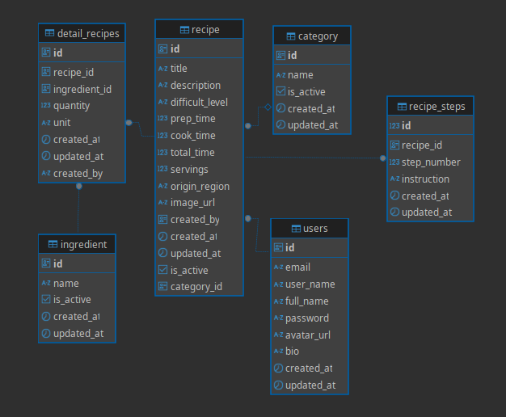

# 🍳 resep-masakan-monolith: Recipe API - Modular Monolith

[](https://go.dev/)
[](https://github.com/gin-gonic/gin)
[](https://gorm.io/)
[](https://opensource.org/licenses/MIT)

Project **Backend Resep Masakan** ini dibangun menggunakan **Golang** (dengan **Gin** dan **GORM**) yang mengimplementasikan arsitektur **Modular Monolith**. Sistem ini dirancang untuk mengelola resep, kategori, bahan, dan detail resep secara efisien, dengan keamanan yang ditingkatkan melalui **JWT Authentication**.

## ✨ Fitur Utama

-   **🔐 Autentikasi & Otorisasi JWT**: Implementasi penuh untuk *Register*, *Login*, dan *Logout*.
-   **📦 Manajemen Master Data**:
    -   **Kategori**: *Create*, *Read*, *Soft Delete*.
    -   **Bahan (Ingredient)**: *Create*, *Read*, *Soft Delete*.
-   **📝 Manajemen Resep**: *Create*, *Read* (Semua/Berdasarkan ID), *Update*, *Delete*.
-   **🔗 Manajemen Detail Resep**: Mengelola relasi *many-to-many* antara Resep dan Bahan.
-   **🏗️ Arsitektur Modular Monolith**: Struktur kode yang terorganisir per module (*handler*, *service*, *repository*, *dto*, *entity*).
-   **💾 Dukungan Database Fleksibel**: Dapat menggunakan **MySQL** atau **PostgreSQL** via GORM.


## 🛠️ Tech Stack

| Teknologi | Keterangan |
| :--- | :--- |
| **Golang** | Bahasa pemrograman utama. |
| **Gin Framework** | Web framework untuk menangani *HTTP request/response*. |
| **GORM** | ORM (Object-Relational Mapping) untuk interaksi database. |
| **JWT** | JSON Web Token untuk mekanisme autentikasi. |
| **MySQL / PostgreSQL** | Pilihan database utama. |
| **Modular Monolith** | Pola arsitektur yang diterapkan. |

### Struktur Modular

Setiap **module** (Auth, Category, Ingredient, Recipe, dll.) distrukturkan dengan lapisan-lapisan berikut:

-   `handler`: Menangani *HTTP request* dan *response*.
-   `service`: Berisi *business logic* utama.
-   `repository`: Lapisan untuk komunikasi dan operasi database.
-   `entity`: Model representasi tabel database.
-   `dto` (Data Transfer Object): Digunakan untuk format *request* dan *response*.


## 📊 ERD (Entity Relationship Diagram)



**Penjelasan Singkat Entitas:**

-   `Users`: Menyimpan data pengguna.
-   `Category`: Kategori resep (contoh: *Dessert*, *Minuman*, *Sup*).
-   `Ingredient`: Daftar bahan masakan yang tersedia.
-   `Recipe`: Data utama resep.
-   `Detail_Recipes`: Tabel penghubung (*pivot*) relasi *many-to-many* antara `Recipe` dan `Ingredient`.


## 🔑 Authentication

Sistem ini menggunakan **JWT (JSON Web Token)** dengan skema **Bearer Token** untuk mengamankan *endpoint*.

**Mekanisme:**

1.  *Login* berhasil akan menghasilkan token JWT.
2.  Token ini harus disertakan dalam *header* setiap *request* ke *endpoint* yang membutuhkan otorisasi.

**Contoh Header Request:**
```
Authorization: Bearer <your_token_here>
```

---

## 📡 Endpoint API

Semua *endpoint* selain `/auth/register` dan `/auth/login` **membutuhkan JWT Authorization** di *header*.

| Module | Method | Endpoint | Deskripsi |
| :--- | :--- | :--- | :--- |
| **Auth** | `POST` | `/api/v1/auth/register` | Registrasi user baru. |
| | `POST` | `/api/v1/auth/login` | Login dan dapatkan JWT token. |
| | `POST` | `/api/v1/auth/logout` | Logout user (menghapus token di sisi server). |
| **Category** | `POST` | `/api/v1/category/create` | Tambah kategori baru. |
| | `GET` | `/api/v1/categories` | Ambil semua kategori. |
| | `PATCH` | `/api/v1/category/delete` | Soft delete kategori. |
| **Ingredient**| `POST` | `/api/v1/ingredient/create` | Tambah bahan baru. |
| | `GET` | `/api/v1/ingredients` | Ambil semua bahan. |
| | `PATCH` | `/api/v1/ingredient/delete` | Soft delete bahan. |
| **Recipe** | `POST` | `/api/v1/recipe/create` | Tambah resep baru. |
| | `GET` | `/api/v1/recipes` | Ambil semua resep. |
| | `GET` | `/api/v1/recipe/:id` | Ambil resep berdasarkan ID. |
| | `GET` | `/api/v1/recipe/detail/:id` | Ambil detail lengkap dari sebuah resep. | 
| | `PUT` | `/api/v1/recipe/update/:id` | Update resep. |
| | `DELETE` | `/api/v1/recipe/delete/:id` | Hapus resep. |
| **Detail Recipe** | `POST` | `/api/v1/recipe-ingredient/create` | Tambah bahan ke resep. |
| | `GET` | `/api/v1/recipe-ingredients` | Ambil semua detail resep. |
| | `GET` | `/api/v1/recipe-ingredient/:id` | Ambil detail resep berdasarkan ID. |
| | `GET` | `/api/v1/ingredient/recipe/:recipe_id` | Ambil bahan dari suatu resep. |
| | `PUT` | `/api/v1/recipe-ingredient/update/:id` | Update detail resep. |
| | `DELETE` | `/api/v1/recipe-ingredient/delete/:id` | Hapus detail resep. |
| **Recipe Steps** | `POST` | `/api/v1/step/create`| Tambah langkah-langkah ke resep. |
| | `GET` | `/api/v1/recipe/step` | Ambil semua langkah-langkah resep. |
| | `PUT` | `/api/v1/step/update/:id` | Update langkah-langkah resep. |
| | `DELETE` | `/api/v1/step/delete/:id` | Hapus langkah-langkah resep. |

---

## 🚀 Cara Menjalankan Project

Ikuti langkah-langkah di bawah untuk menjalankan *project* ini secara lokal.

### 1. Clone Repository

```bash
git clone https://github.com/username/resep-masakan-monolith.git
cd resep-masakan-monolith
````

### 2\. Konfigurasi Environment

Buat file `.env` di *root* direktori *project* dan sesuaikan dengan konfigurasi database Anda.

**.env**

```dotenv
# Database Configuration (Contoh: MySQL)
DB_HOST=localhost
DB_PORT=3306
DB_USER=root
DB_PASS=password
DB_NAME=resep_masakan

# Application Server Port
APP_PORT=8080

# JWT Secret Key
JWT_SECRET=your_secret_key_yang_sangat_panjang_dan_aman
```

### 3\. Jalankan Aplikasi

Pastikan Anda memiliki **Golang versi 1.20 atau lebih baru** terinstal.

```bash
go run ./cmd/
```

### 4\. Akses API

Aplikasi akan berjalan pada port 8080 secara *default*.

```
http://localhost:8080/api/v1 (Jika dijalankan di lokal)
```

-----

## 📬 Contoh Request via Swagger / Postman

**Cooming Soon**

```

```


